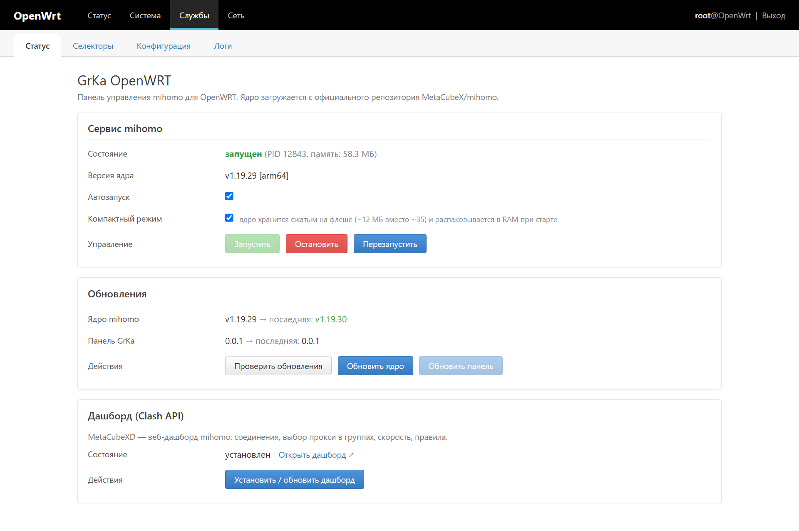
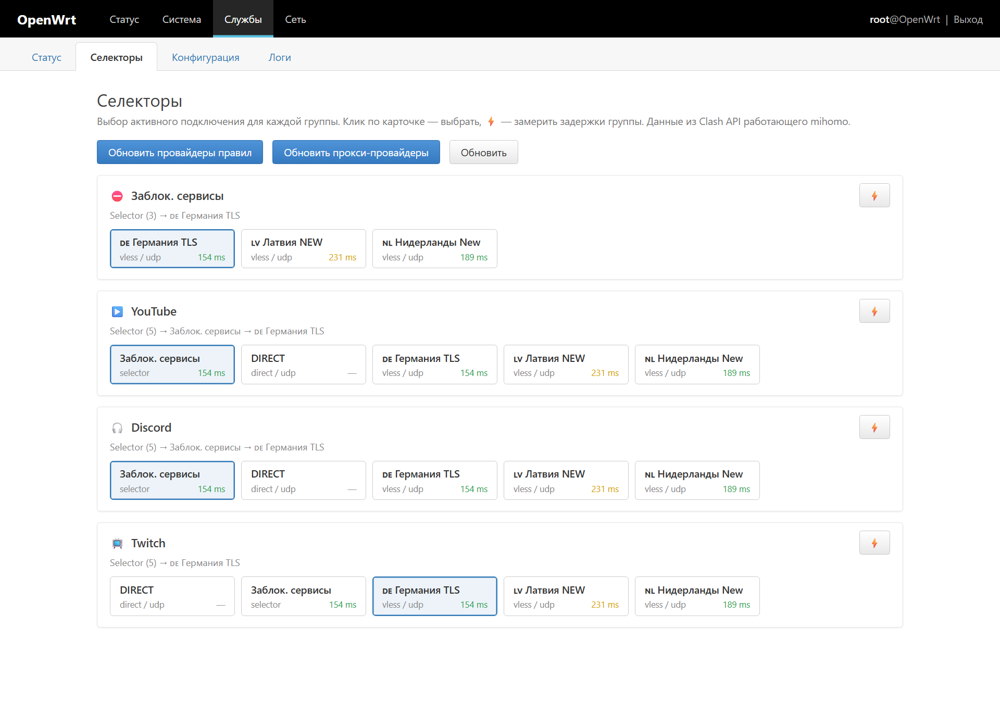
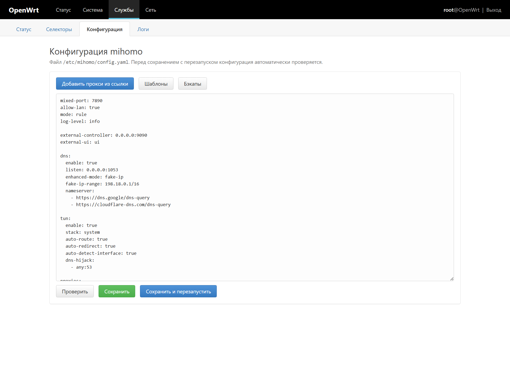
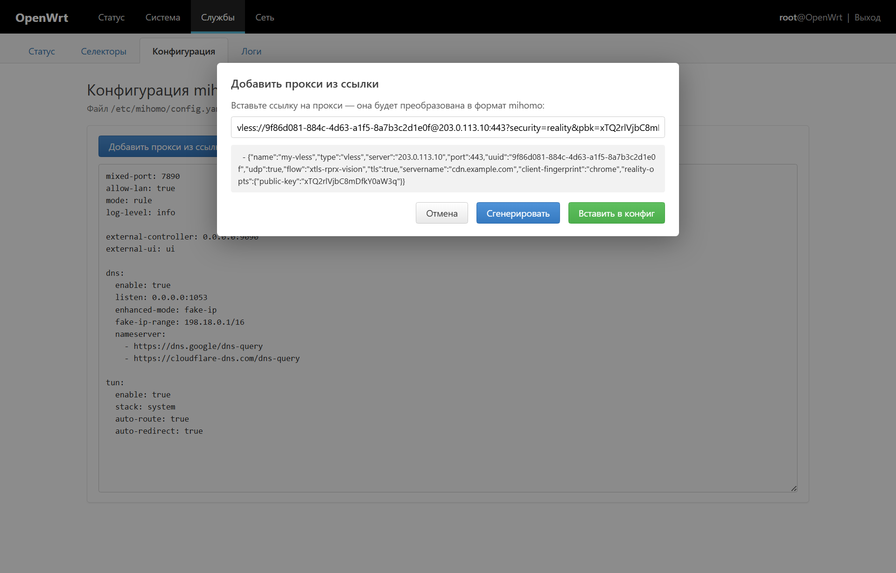
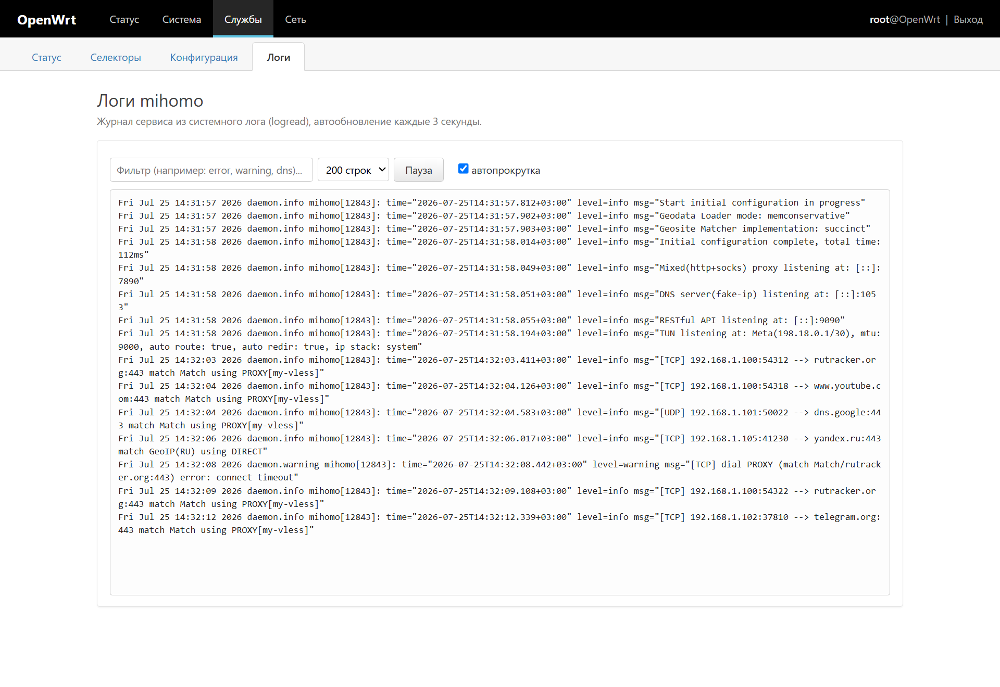

# GrKa OpenWRT

Панель управления **mihomo** для **OpenWRT**, встроенная в LuCI: *Службы → GrKa OpenWRT*.

Аналог [XKeen-UI](https://github.com/zxc-rv/XKeen-UI) (Keenetic), но сделанный «по-родному» для OpenWRT: rpcd-бэкенд на shell + клиентские LuCI-view, без отдельного веб-сервера и лишних зависимостей.

## Возможности

- **Статус** — запуск/остановка/перезапуск mihomo, автозапуск, PID и потребление памяти
- **Селекторы** — выбор активного прокси в группах прямо из LuCI (через Clash API): клик по карточке — выбрать, ⚡ — замерить задержки, обновление rule/proxy-провайдеров
- **Ядра** — установка и обновление ядра mihomo с официального репозитория [MetaCubeX/mihomo](https://github.com/MetaCubeX/mihomo) (архитектура определяется автоматически)
- **Компактный режим** — ядро хранится на флеше сжатым (~12 МБ вместо ~35) и распаковывается в RAM при старте; для роутеров с малым флешем (Cudy WR3000H и т.п.)
- **Самообновление** — обновление самой панели с GitHub-релизов в один клик
- **Конфигурация** — редактор `/etc/mihomo/config.yaml` с проверкой (`mihomo -t`) перед перезапуском
- **Шаблоны** — готовые конфигурации в один клик, включая шаблон «Сервисы и селекторы» (YouTube, Discord, Telegram, AI, CDN и др. — по мотивам шаблона zxc-rv, адаптирован под TUN-режим OpenWRT)
- **Генератор прокси** — преобразование ссылок `vless://`, `vmess://`, `trojan://`, `ss://`, `hysteria2://`, `tuic://` в формат mihomo и вставка в конфиг
- **Бэкапы** — автоматический бэкап конфига при каждом сохранении (последние 10), восстановление из панели
- **Логи** — просмотр журнала с автообновлением, фильтром и автопрокруткой
- **Дашборд** — установка [MetaCubeXD](https://github.com/MetaCubeX/metacubexd) (Clash API UI: соединения, выбор прокси, скорость) в один клик

## Скриншоты

**Статус** — управление сервисом, компактный режим, обновление ядра mihomo и самой панели, установка дашборда:



**Селекторы** — выбор активного прокси в группах, замер задержек, обновление провайдеров:



**Конфигурация** — редактор `config.yaml` с проверкой, шаблонами, бэкапами и генератором прокси:



**Генератор прокси** — ссылка `vless://` / `vmess://` / `trojan://` / `ss://` / `hysteria2://` / `tuic://` превращается в формат mihomo и вставляется в конфиг:



**Логи** — журнал mihomo с автообновлением и фильтром:



## Требования

- OpenWRT 22.03+ с LuCI (современный JS-клиент)
- ~40 МБ свободного места для ядра mihomo, либо ~12 МБ в компактном режиме (ядро хранится сжатым и распаковывается в RAM — потребуется ~35 МБ RAM дополнительно)
- `kmod-tun` для TUN-режима: `opkg update && opkg install kmod-tun`
- HTTPS-загрузки: `curl` или `uclient-fetch` с `libustream-*ssl` и `ca-bundle` (есть в стандартных сборках)

## Установка

```sh
sh -c "$(wget -qO- https://raw.githubusercontent.com/Soporif1c/GrKa-OpenWRT/main/install.sh)"
```

или через curl:

```sh
sh -c "$(curl -fsSL https://raw.githubusercontent.com/Soporif1c/GrKa-OpenWRT/main/install.sh)"
```

Установщик скачает последний релиз панели, поставит ядро mihomo с официального репозитория, создаст конфиг по умолчанию и включит автозапуск.

После установки: **LuCI → Службы → GrKa OpenWRT**

1. «Конфигурация» → «Добавить прокси из ссылки» → пропишите имя прокси в `proxy-groups` и `rules`
2. «Сохранить и перезапустить»
3. «Статус» → убедитесь, что сервис запущен

## Обновление

- **Ядро mihomo**: Статус → «Проверить обновления» → «Обновить ядро»
- **Панель**: Статус → «Проверить обновления» → «Обновить панель»
- Либо повторный запуск установочной команды — она всегда ставит последний релиз

## Как это устроено

```
/usr/libexec/rpcd/luci.grka                       rpcd-бэкенд (ubus-объект luci.grka)
/usr/libexec/grka/common.sh                       общие функции (GitHub API, определение архитектуры)
/usr/libexec/grka/core-update.sh                  установка/обновление ядра mihomo
/usr/libexec/grka/self-update.sh                  самообновление панели
/usr/libexec/grka/dashboard-install.sh            установка MetaCubeXD
/usr/libexec/grka/compact-toggle.sh               переключение компактного режима хранения ядра
/usr/share/grka/templates/*.yaml                  шаблоны конфигураций
/etc/init.d/mihomo                                procd-сервис mihomo
/etc/mihomo/config.yaml                           конфигурация (не трогается при обновлениях)
/etc/mihomo/backups/                              бэкапы конфигурации
/usr/share/luci/menu.d/luci-app-grka.json         пункт меню LuCI
/usr/share/rpcd/acl.d/luci-app-grka.json          права доступа
/www/luci-static/resources/view/grka/*.js         вкладки Статус / Селекторы / Конфигурация / Логи
```

Сборка релизного архива: `./build.sh` → `grka-openwrt-<version>.tar.gz`

## Удаление

```sh
/etc/init.d/mihomo stop; /etc/init.d/mihomo disable
rm -rf /usr/libexec/grka /usr/libexec/rpcd/luci.grka /usr/share/grka \
  /usr/share/luci/menu.d/luci-app-grka.json /usr/share/rpcd/acl.d/luci-app-grka.json \
  /www/luci-static/resources/view/grka /etc/init.d/mihomo /usr/bin/mihomo
# конфигурация: rm -rf /etc/mihomo
rm -rf /tmp/luci-indexcache* /tmp/luci-modulecache; /etc/init.d/rpcd restart
```

## Лицензия

MIT
